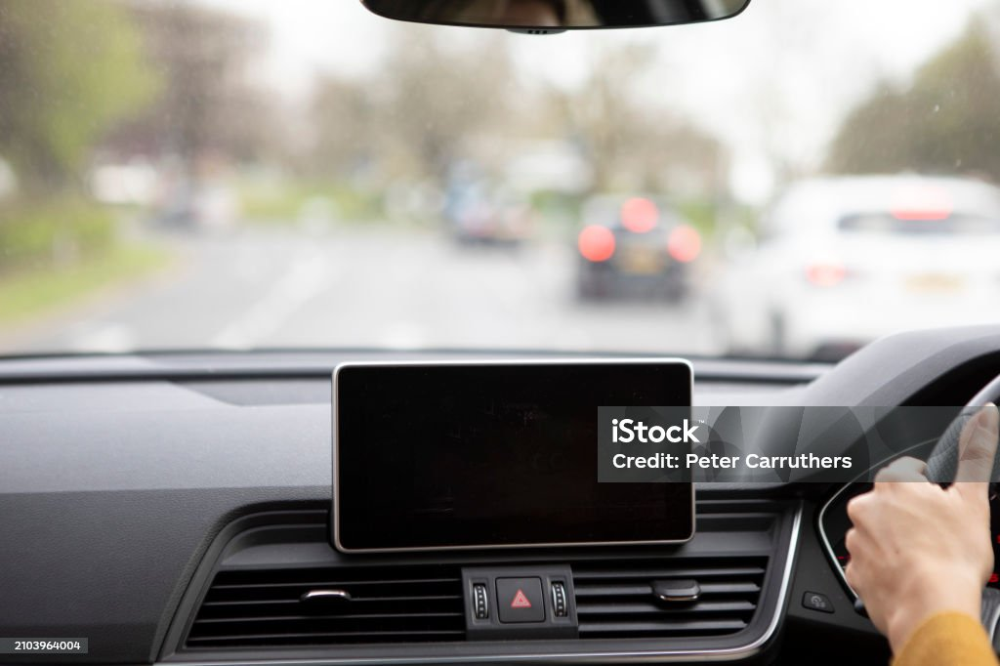
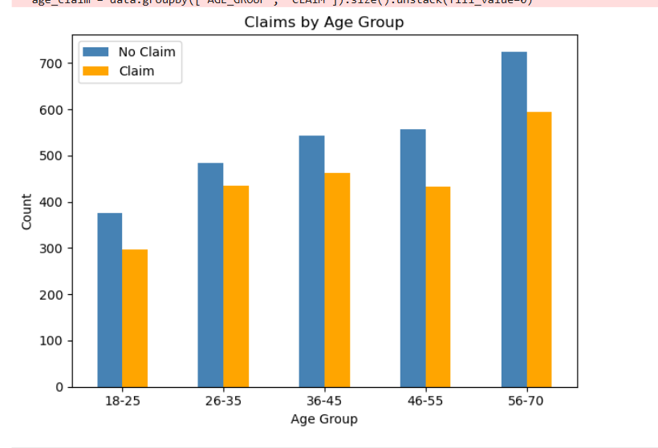
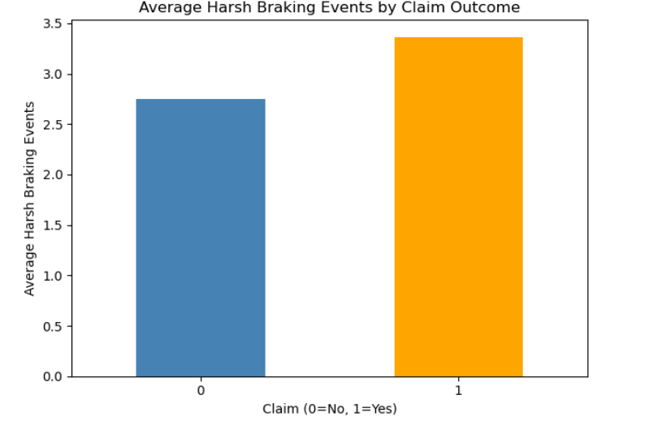
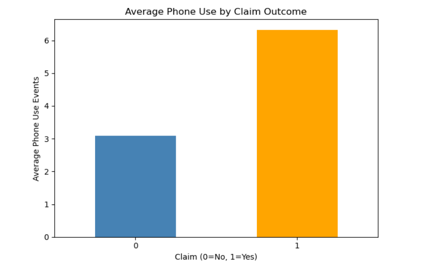
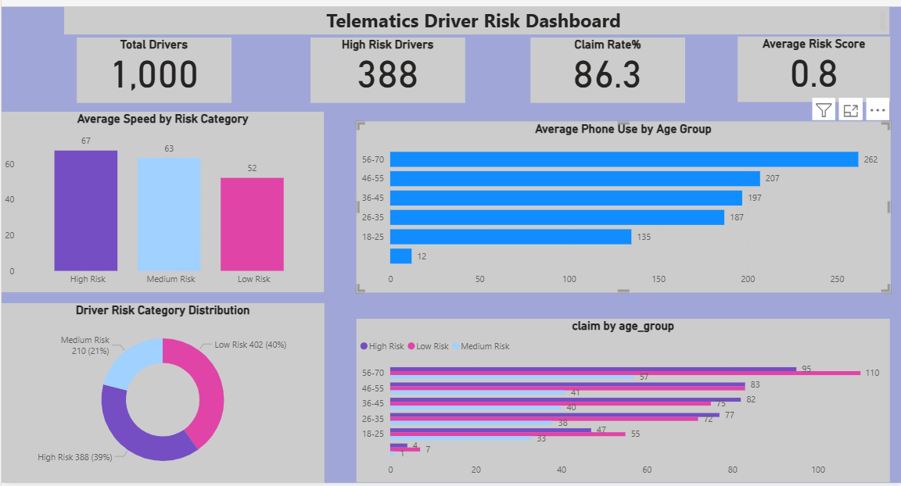

# Telematics Driver Risk Dashboard

**Tools:** Python · Scikit-learn · Power BI  

## Problem
Insurance companies price risk using static information 
like age and vehicle type. Telematics changes that by 
using real driving behaviour data to assess risk accurately.

## Objective
Use telematics driving data to score drivers by risk, 
segment them into Low, Medium and High risk bands, and 
predict claim likelihood using machine learning.

## Key Results
| Metric | Value |
|---|---|
| Total Drivers Scored | 1,000 |
| High Risk Drivers | 388 (39%) |
| Medium Risk Drivers | 210 (21%) |
| Low Risk Drivers | 402 (40%) |
| Model Accuracy | 83% |
| Average Risk Score | 0.8 |
## Key Findings

### 1. High Risk Drivers Speed More
High risk drivers average 67mph vs 52mph for low risk drivers.

---

### 2. Older Drivers Have Highest Claim Rate
Drivers aged 56-70 have the highest claim rate across all risk categories.

---

### 3. Harsh Braking Predicts Claims
Drivers who brake harshly are significantly more likely to make a claim.

---

### 4. Phone Use Increases Risk
Higher phone use while driving strongly correlates with claim likelihood.

## Dashboard

## Tools Used
- Python (Pandas, Scikit-learn, Matplotlib)
- Power BI Desktop
- Jupyter Notebook
- GitHub

*This project mirrors Admiral Group's LittleBox telematics 
product which uses real driving data to price insurance fairly.*

